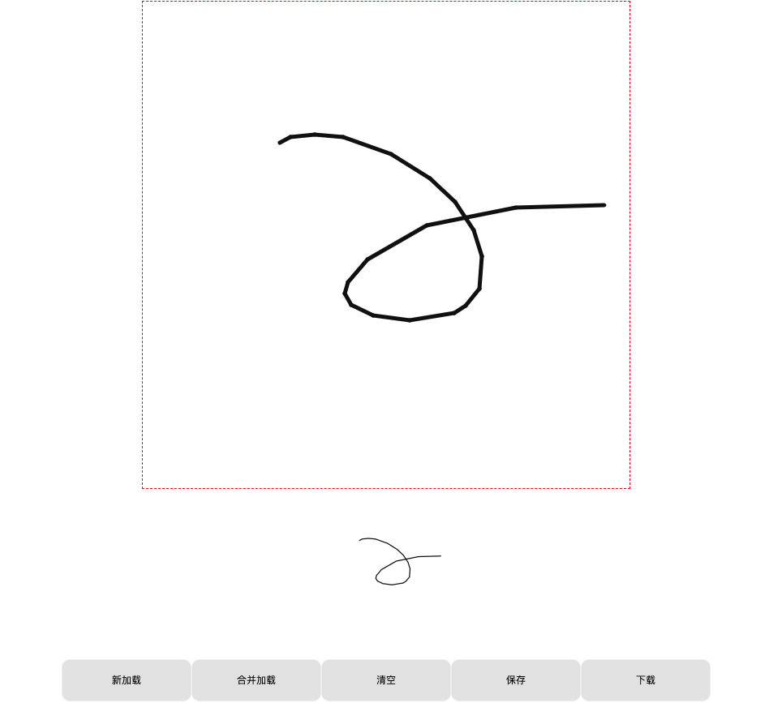

# sign-canvas 一个基于canvas开发,封装于Vue组件的通用手写签名板(电子签名板),支持pc端和移动端;
## 同时支持重新签名，覆盖签名，下载，保存等

## 下载安装npm包
```bash
git clone https://github.com/mose-x/vue-sign-canvas.git
```

## 安装依赖
```bash
cd vue-sign-canvas
npm i
```

### 开发环境运行
```bash
npm run dev
```

### 生产打包
```bash
npm run build
```

## 缺陷 & 后期计划

> 目前还没有撤销回到上一步的操作,一旦输入错了就只有清除重写了
> 如果有需要还是可以考虑加上回到上一步的方法.

<a href='test.html'/>
## 纯js版点击此处可查看


## 效果图如下
